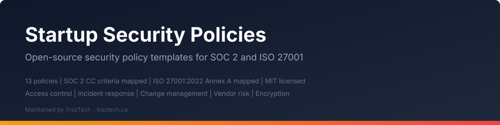

<p align="center">
  
</p>

# Startup Security Policies

**Open-source security policy templates for startups preparing for SOC 2, ISO 27001, and other compliance audits.**

Maintained by [TrazTech](https://traztech.ca) | Toronto-based Security & Compliance Consultancy

---

## What Is This?

This repository contains 15 production-ready security policy templates that map directly to SOC 2 Trust Services Criteria and ISO 27001:2022 Annex A controls. They are written for startups, SaaS companies, and growth-stage organizations that need real, auditor-accepted policies: not generic boilerplate.

Every template has been informed by hands-on audit preparation experience. TrazTech's principal, [Jacob Masse](https://jacobmasse.com): a published security researcher with 5 CVEs including [CVE-2024-45163](https://nvd.nist.gov/vuln/detail/CVE-2024-45163) (CVSS 9.1): has guided startups from zero to SOC 2 Type II with zero exceptions across 76 controls, in as few as 75 days, and saved clients an average of $11K on audit quotes.

## Who Is This For?

- **Startups** preparing for their first SOC 2 Type I or Type II audit
- **SaaS companies** building an ISO 27001-compliant ISMS from scratch
- **Engineering and security teams** that need a policy foundation they can actually maintain
- **Compliance leads** who want templates grounded in real audit experience, not theory

## How to Use These Templates

### 1. Clone the Repository

```bash
git clone https://github.com/TrazTech-Inc/startup-security-policies.git
```

### 2. Customize Placeholders

Every template uses standardized placeholders. Find and replace these with your organization's details:

| Placeholder | Replace With |
|---|---|
| `[COMPANY_NAME]` | Your company's legal name |
| `[DATE]` | The effective date of the policy |
| `[REVIEW_DATE]` | Next scheduled review date |
| `[POLICY_OWNER]` | Role or person responsible for the policy |
| `[APPROVED_BY]` | Executive or board member who approves |
| `[VERSION]` | Your version number (start with 1.0) |
| `[SECURITY_TEAM_EMAIL]` | Your security team's email address |
| `[INCIDENT_RESPONSE_EMAIL]` | Your IR notification email |
| `[LEGAL_CONTACT]` | Your legal department contact |

See [CUSTOMIZATION.md](CUSTOMIZATION.md) for detailed guidance on adapting each template.

### 3. Review and Approve

Have each policy reviewed by the appropriate stakeholder (CISO, CTO, legal counsel) and formally approved before your audit.

### 4. Publish and Train

Distribute policies to employees, conduct awareness training, and store approved versions in your document management system.

## Included Policy Templates

| Policy | File | Description |
|---|---|---|
| Information Security Policy | [policies/information-security-policy.md](policies/information-security-policy.md) | Top-level ISMS policy establishing the security program |
| Acceptable Use Policy | [policies/acceptable-use-policy.md](policies/acceptable-use-policy.md) | Rules for employee use of company systems and data |
| Access Control Policy | [policies/access-control-policy.md](policies/access-control-policy.md) | Logical access, RBAC, least privilege, MFA |
| Change Management Policy | [policies/change-management-policy.md](policies/change-management-policy.md) | SDLC, code review, deployment controls |
| Incident Response Policy | [policies/incident-response-policy.md](policies/incident-response-policy.md) | Detection, triage, containment, notification |
| Data Classification Policy | [policies/data-classification-policy.md](policies/data-classification-policy.md) | Classification levels and data handling rules |
| Vendor Management Policy | [policies/vendor-management-policy.md](policies/vendor-management-policy.md) | Third-party risk assessment and due diligence |
| Business Continuity Policy | [policies/business-continuity-policy.md](policies/business-continuity-policy.md) | BCP/DR planning, RTO/RPO targets |
| Encryption Policy | [policies/encryption-policy.md](policies/encryption-policy.md) | Encryption standards and key management |
| Human Resources Security Policy | [policies/human-resources-security-policy.md](policies/human-resources-security-policy.md) | Onboarding, offboarding, security training |
| Logging & Monitoring Policy | [policies/logging-monitoring-policy.md](policies/logging-monitoring-policy.md) | Centralized logging, retention, alerting |
| Physical Security Policy | [policies/physical-security-policy.md](policies/physical-security-policy.md) | Office and datacenter physical controls |
| Risk Management Policy | [policies/risk-management-policy.md](policies/risk-management-policy.md) | Risk assessment methodology and risk register |
| AI Acceptable Use Policy | [policies/ai-acceptable-use-policy.md](policies/ai-acceptable-use-policy.md) | Rules for AI tool usage, data handling, and code review |
| Privacy & Data Protection Policy | [policies/privacy-policy.md](policies/privacy-policy.md) | Privacy rights, lawful basis, breach notification, PIAs |

## Framework Mapping Overview

Each policy maps to specific SOC 2 Trust Services Criteria (CC) and ISO 27001:2022 Annex A controls. The full mapping matrix is available in [FRAMEWORK_MAPPING.md](FRAMEWORK_MAPPING.md).

| Policy | SOC 2 Criteria | ISO 27001:2022 Annex A |
|---|---|---|
| Information Security | CC1.1 | A.5.1-5.4 |
| Acceptable Use | CC1.4 | A.5.10 |
| Access Control | CC6.1-6.3 | A.8.2-8.5 |
| Change Management | CC8.1 | A.8.25-8.33 |
| Incident Response | CC7.3-7.5 | A.5.24-5.28 |
| Data Classification | CC6.1 | A.5.12-5.13 |
| Vendor Management | CC9.2 | A.5.19-5.22 |
| Business Continuity | A1.2-A1.3 | A.5.29-5.30 |
| Encryption | CC6.1 | A.8.24 |
| HR Security | CC1.4 | A.6.1-6.6 |
| Logging & Monitoring | CC7.1-7.2 | A.8.15-8.16 |
| Physical Security | CC6.4 | A.7.1-7.14 |
| Risk Management | CC3.1-3.4 | A.5.2-5.6 |
| AI Acceptable Use | CC1.4, CC6.1, CC6.7 | A.5.10, A.8.24 |
| Privacy & Data Protection | P1.0-P1.2 | A.5.34 |

## Implementation Guidance

Building a compliance program is more than writing policies. These resources from TrazTech will help you operationalize what you adopt here:

- **[SOC 2 Readiness Checklist](https://traztech.ca/soc-2-readiness-checklist)**: Free interactive checklist covering all Trust Services Criteria
- **[Cloud Security Posture Check](https://traztech.ca/tools/cloud-security-posture-check)**: Free tool to assess your cloud environment's security baseline
- **[Keeping Evidence Fresh](https://traztech.ca/blog/keeping-evidence-fresh)**: Why stale evidence fails audits and how to automate collection
- **[Who Owns Compliance After Readiness?](https://traztech.ca/blog/who-owns-compliance-after-readiness)**: Defining long-term ownership so your program doesn't decay
- **[Compliance Calendar: What Actually Recurs](https://traztech.ca/blog/compliance-calendar-what-actually-recurs)**: The recurring tasks that keep your controls operational year-round
- **[Control Drift Between Audits](https://traztech.ca/blog/control-drift-between-audits)**: How to detect and prevent controls from degrading after your audit

## See Also

- [awesome-soc2](https://github.com/TrazTech-Inc/awesome-soc2) - Curated list of SOC 2 resources, tools, and guides.
- [cloud-security-audit-scripts](https://github.com/TrazTech-Inc/cloud-security-audit-scripts) - Pre-audit cloud security scripts for AWS, GCP, and Azure.
- [awesome-compliance-automation](https://github.com/TrazTech-Inc/awesome-compliance-automation) - 270+ compliance automation tools across all major frameworks.
- [vendor-risk-assessment-toolkit](https://github.com/TrazTech-Inc/vendor-risk-assessment-toolkit) - Vendor risk assessment templates, scoring, and automation.

## Free Compliance Tracking

TrazTech offers a **free compliance tracking workspace** to help startups manage policies, evidence, and control status in one place. Visit [traztech.ca](https://traztech.ca) to get started.

## Contributing

Contributions are welcome. If you have suggestions for improving these templates or want to add mappings for additional frameworks (HIPAA, PCI DSS, NIST CSF), please open an issue or submit a pull request.

## License

This project is licensed under the MIT License. See [LICENSE](LICENSE) for details.

---

### Maintained by TrazTech

[TrazTech](https://traztech.ca) is a security and compliance consultancy based in Toronto, specializing in SOC 2 readiness, ISO 27001, HIPAA, PCI DSS, penetration testing, and cloud security. Led by [Jacob Masse](https://jacobmasse.com), a published security researcher with 5 CVEs including CVE-2024-45163 (CVSS 9.1), TrazTech has achieved zero exceptions on SOC 2 Type II audits across 76 controls and helped startups reach audit-ready status in as few as 75 days.

**Get in touch:** [traztech.ca](https://traztech.ca)
